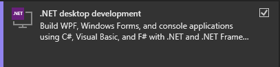
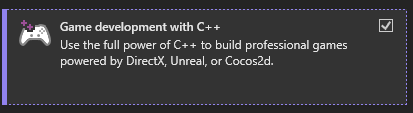
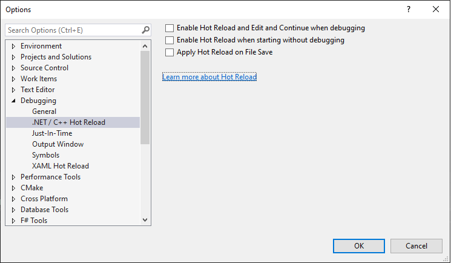
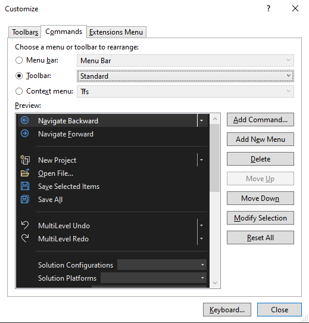
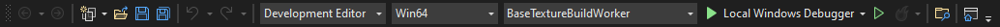
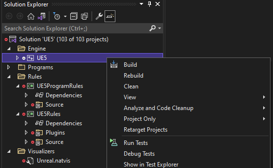

---
title: Building From Source
layout: page
filename: BuildFromSource.md
--- 

# Building Unreal 5 from Source

This is a brief guide on downloading and building UE5 using git command line tools
and Visual Studio 2022

## Github Account

If you don't have a github account, goto [github.com](https://github.com/) and make one

## Epic Games Account

If you don't have a Epic Games account, goto [epicgames.com/register](https://www.epicgames.com/id/register) and create one

## Connecting the Epic Games account to the Github account

You need to connect your Epic Games account to you github account so you can get access to Epic's
github repositories

To do this:
- sign into your Epic Games account at [epicgames.com](https://epicgames.com)
- click on your username near the top right corner of the page and select "Account" from the dropdown menu
- click on "Connections" in the list of options on the left side of the page
- select "Accounts" from the tab bar with the "Apps" and "Accounts" options
- under the github icon click the "Connect" button.  This will guide you through a series of steps to connect
your Epic Games and github accounts

## Installing git

If you do not already have the git commandline tools installed, install them from [git-scm.com/downloads](https://git-scm.com/downloads)

## Installing Visual Studio 2022

If you do not already have Visual Studio 2022 installed, install it from [visualstudio.microsoft.com](https://visualstudio.microsoft.com/vs/)

Install at least these options:



and



## Configuring Visual Studio 2022

Some useful options you might like to set are:

### Disable Hot Reload

In Tools|Options|Debugging|.NET/C++ Hot Reload disable all the Hot Reload options



### Set Solution Configurations dropdown width

Change the width of the Solution Configurations dropdown to handle the longer names used by 
UE:
- right-click on the toolbar shown below, select "Customize"


- change to the "Commands" tab
- select "Toolbar" in the top radio button group
- change the toolbar value from "Build" to "Standard" like so:



- in the preview panel select "System Configurations" 
- click the "Modify Selection" button
- change the width to 130 
- press "OK" and "Close"

The toolbar will now have changed to


### Turn on Indexing

To make sure indexed searching is enabled, go to Tools > Options > Environment > Preview Features and verify that “Enable indexing for faster find experience” is checked!

See [devblogs.microsoft.com](https://devblogs.microsoft.com/visualstudio/code-search-in-visual-studio-is-about-to-get-much-faster/)


## Downloading the source

Make a new directory such as c:\work, and change into it

Clone the Unreal Engine source repository:

```
git clone https://github.com/EpicGames/UnrealEngine.git UnrealSource
```

where ```UnrealSource``` is the name of a new directory to which the source will be downloaded

## Installing UnrealVS

UnrealVS is a Visual Studio plugin from Epic.  It is included in the 
If you are using Visual Studio 2022 exit Visual Studio and install this file
[UnrealEngineSource]\Engine\Extras\UnrealVS\VS2022\UnrealVS.vsix by double clicking it


## Choosing a branch

This page [github.com/EpicGames/UnrealEngine/branches](https://github.com/EpicGames/UnrealEngine/branches) lists significant branches including:

- release - the latest released version of UE
- ue5-main - most up to date - this is being continuously updated and won't necessarily build or run on any given day

Change into the new source directory created by the git clone command.

Run ```git checkout [branch-name]``` for whichever branch you chose to build

## Building

This is a summary of information from [https://github.com/EpicGames/UnrealEngine/tree/master]

Change to the directory in which you downloaded the UE source code and
run this command to download and install prerequisites required to build UE - it might take a while:

```
Setup.bat
```
then run
```
GenerateProjectFiles.bat -2022
```


## Open Solution

The above commands will create UE5.sln in the current directory, open it
in Visual Studio and:
- change the Solution Configration dropdown to "Development Editor"
- change the Solution Platform to "Win64"
- right click the UE5 project in the solution explorer and choose "Build"



This will take some time to complete.  On a Ryzen 5950x 16 core machine using 
an M.2 SSD it took 37 minutes.

## Running Unreal

In the solution explorer right-click "UE5" under the "Engine" entry at the top
and select "Set as Startup Project".

Press F5 to run UE

## Earlier versions

These instructions will work for Unreal 4.27 and Visual Studio 2022.  Make sure you
clone the git repository then checkout the 4.27 branch *before* you run
Setup.bat or GenerateProjectFiles.bat

The solution file created will be called UE4.sln not UE5.sln

